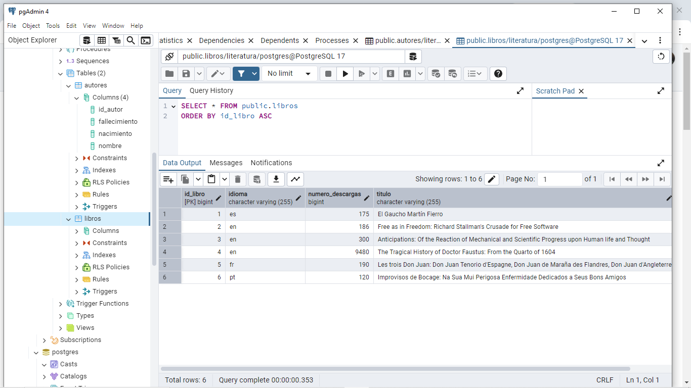
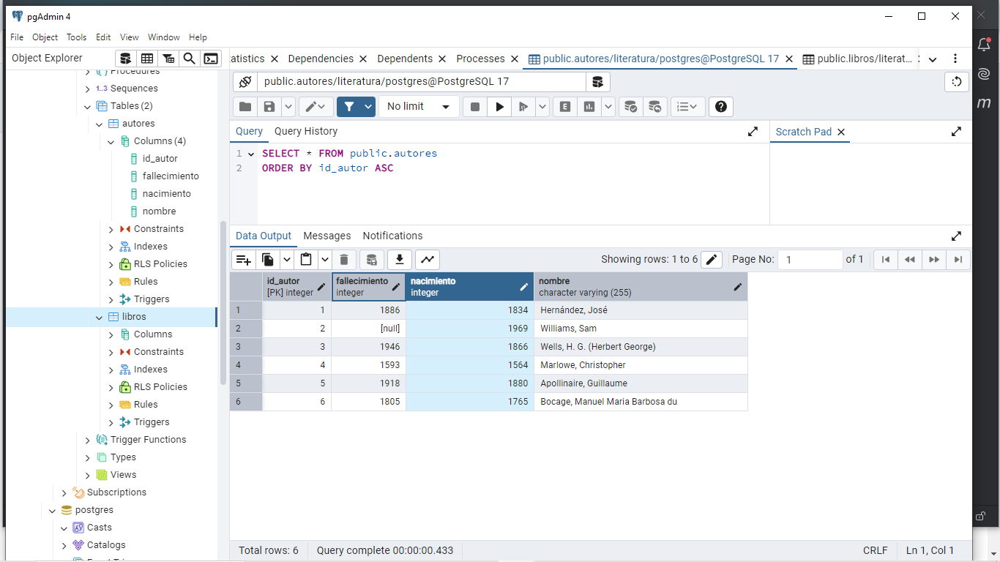

```markdown
# Proyecto Literatura - App de Búsqueda y Gestión de Libros

Este proyecto es una aplicación de consola que interactúa con una base de datos relacinal para gestionar libros y autores, permitiendo realizar diversas búsquedas y operaciones sobre ellos.
La aplicación está construida en Java con Spring Boot y JPA para manejar la persistencia de los datos en una base de datos relacional.

## Descripción de las Funcionalidades

La aplicación permite realizar las siguientes acciones a través de un menú interactivo:

1. **Buscar libro por título**: Permite buscar un libro por su título o parte de él.
2. **Listar libros buscados anteriormente**: Muestra todos los libros que se han buscado y guardado previamente.
3. **Buscar libros por idioma**: Permite buscar los libros que están en un idioma específico.
4. **Listar autores de libros buscados**: Muestra los autores de los libros que se han buscado previamente.
5. **Listar autores vivos en un año determinado**: Permite listar autores que estuvieron vivos en un año específico.
6. **Contar libros por idioma**: Muestra la cantidad de libros en un idioma determinado.

## Tecnologías Utilizadas

- **Java**: Lenguaje de programación principal.
- **Spring Boot**: Framework para crear aplicaciones Java basadas en Spring.
- **Spring Data JPA**: Proporciona facilidad para interactuar con bases de datos relacionales mediante JPA.
- **pgAdmin 4**
- **Insomnia**

## Requisitos

Para ejecutar el proyecto, necesitarás tener instalados los siguientes componentes:

- JDK 17 o superior.
- Maven (opcional, si no estás usando un IDE que lo maneje).
- Una base de datos en pgAdmin 4.

## Instrucciones de Instalación

1. **Clonar el repositorio:**
   ```bash
   git clone [https://github.com/SILVIAGONZALEZ1/literatura-app.git](https://github.com/SILVIAGONZALEZ1/Literatura.git) 
   cd literatura-app
   ```

2. **Compilar el proyecto**:
   Si tienes Maven instalado, puedes compilar el proyecto ejecutando el siguiente comando:
   ```bash
   mvn clean install
   ```

3. **Ejecutar la aplicación**:
   Después de compilar, puedes ejecutar la aplicación con:
   ```bash
   mvn spring-boot:run
   ```

   La aplicación se ejecutará y mostrará un menú interactivo en la consola donde podrás seleccionar las opciones para interactuar con los libros y autores.

## Estructura de la Base de Datos

La base de datos está estructurada en dos tablas principales:

1. **Autores**:
   - `id_autor`: Identificador único del autor.
   - `nombre`: Nombre del autor.
   - `nacimiento`: Año de nacimiento del autor.
   - `fallecimiento`: Año de fallecimiento del autor (si aplica).

2. **Libros**:
   - `id_libro`: Identificador único del libro.
   - `titulo`: Título del libro.
   - `id_autor`: Relación con el autor del libro (clave foránea).
   - `idioma`: Idioma del libro.
   - `numero_descargas`: Número de descargas del libro.

## Endpoints de la API (si es aplicable)

Si decides exponer esta funcionalidad a través de una API, puedes considerar los siguientes endpoints:

- **GET** `/libros`: Obtiene todos los libros.
- **GET** `/libros/{titulo}`: Busca un libro por título.
- **GET** `/libros/idioma/{idioma}`: Busca libros por idioma.
- **GET** `/autores`: Obtiene todos los autores.
- **GET** `/autores/vivos/{año}`: Lista autores vivos en el año especificado.

## Contribuciones

¡Las contribuciones son bienvenidas! Si deseas contribuir al proyecto, sigue estos pasos:

1. Haz un fork del repositorio.
2. Crea una nueva rama para tu funcionalidad (`git checkout -b feature/mi-funcionalidad`).
3. Realiza los cambios y haz un commit (`git commit -am 'Agrega mi nueva funcionalidad'`).
4. Sube los cambios a tu repositorio (`git push origin feature/mi-funcionalidad`).
5. Crea un Pull Request con una descripción detallada de los cambios.

## Contacto

Si tienes alguna pregunta o sugerencia, no dudes en contactarme a través de:

- **Correo electrónico**: devsoftwaregonzalez@gmail.com
- **GitHub**: https://github.com/SILVIAGONZALEZ1
```

 
